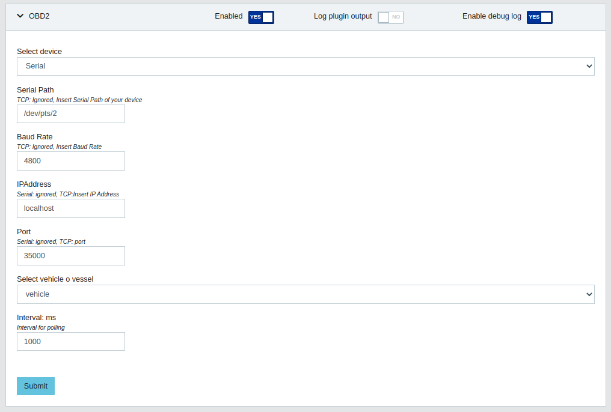
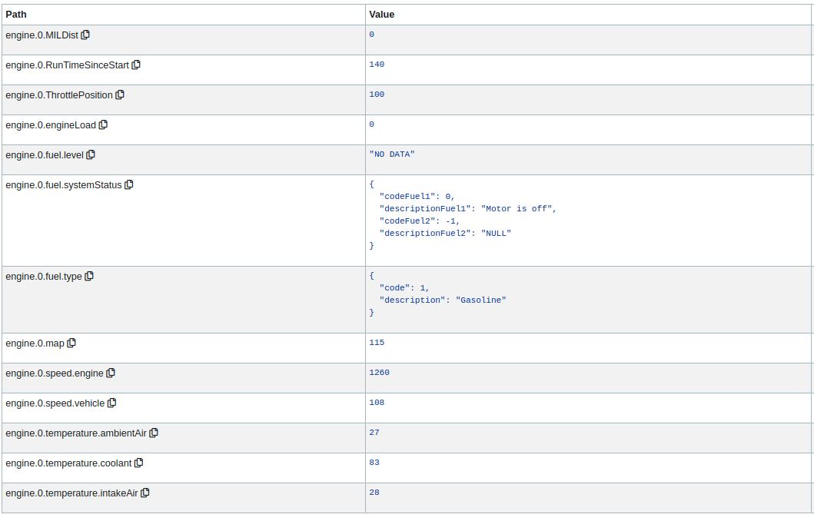

# OBD2-Signalk
## What is OBD?
On-board diagnostics (OBD) is an automotive term referring to a vehicle's self-diagnostic and reporting capability. OBD systems give the vehicle owner or repair technician access to the status of the various vehicle sub-systems. 
You can read OBD data with a OBD interface. 

## Connection to OBD

You can connect to the OBD via **TCP** or **Serial Port**. 

- **TCP**: by inserting IP address and Port;
- **Serial Port**: by inserting serial path and baud rate. 

if you have a device bluetooth interface, it must be paired and connected with rfcomm!.

## PID Supported
The PIDS supported by this plugin are:

| PID | DESCRIPTION |
|-----|-------------|
| 0D  | Vehicle Speed |
| 0C  | RPM |
| 05  | Coolant Temperature |
| 03  | Fuel system |
| 04  | Load Value |
| 0B  | Intake manifold absolute pressure |
| 0F  | Intake air temperature |
| 11  | Absolute Throttle Position |
| 21  | Distance travelled while MIL is activated |
| 1F  | Time since Engine start |
| 46  | Ambient air temperature |
| 51  | Fuel type |
| 2F  | Fuel level |

You can see all PID and his function at website: 

https://en.wikipedia.org/wiki/OBD-II_PIDs

## SignalK output

